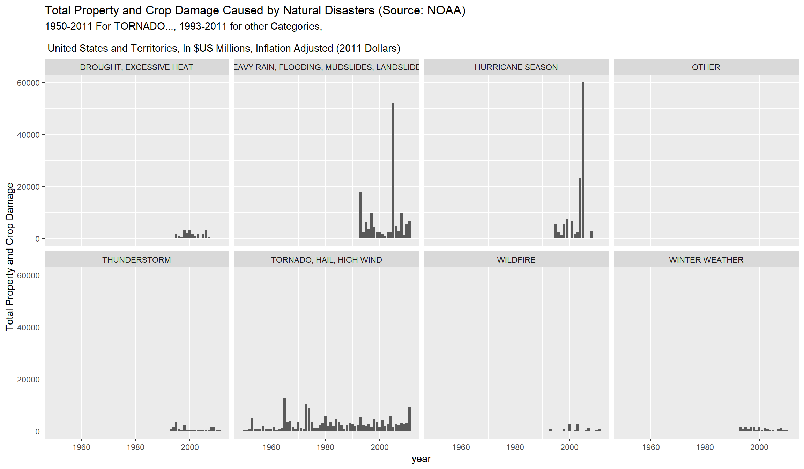
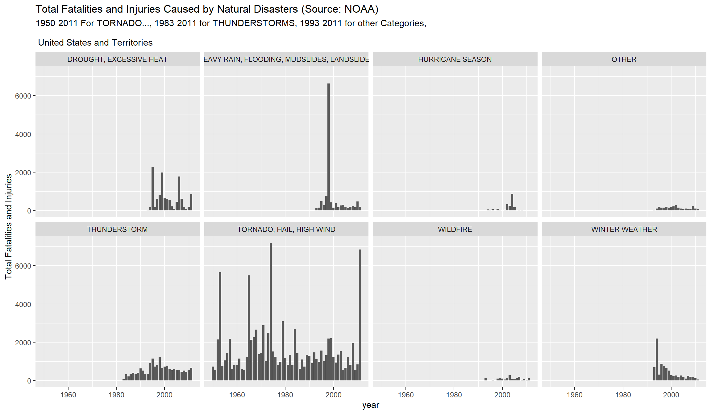
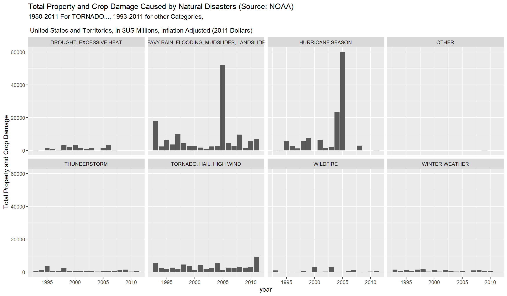

# NOAA Storm Data Analysis

## Note for grader

The complete submission is in index.PDF.

-----

This analysis is in fulfillment of the Course 5, Week 4 assignment for the John Hopkins Data Science in R series of Coursera courses. 

Assignment

The basic goal of this assignment is to explore the NOAA Storm Database and answer some basic questions about severe weather events. You must use the database to answer the questions below and show the code for your entire analysis. Your analysis can consist of tables, figures, or other summaries. You may use any R package you want to support your analysis.

Questions

Your data analysis must address the following questions:

1.	Across the United States, which types of events (as indicated in the EVTYPE variable) are most harmful with respect to population health?

2.	Across the United States, which types of events have the greatest economic consequences?
Consider writing your report as if it were to be read by a government or municipal manager who might be responsible for preparing for severe weather events and will need to prioritize resources for different types of events. However, there is no need to make any specific recommendations in your report.

Review criteria
1.	Has either a (1) valid RPubs URL pointing to a data analysis document for this assignment been submitted; or (2) a complete PDF file presenting the data analysis been uploaded?
2.	Is the document written in English?
3.	Does the analysis include description and justification for any data transformations?
4.	Does the document have a title that briefly summarizes the data analysis?
5.	Does the document have a synopsis that describes and summarizes the data analysis in less than 10 sentences?
6.	Is there a section titled "Data Processing" that describes how the data were loaded into R and processed for analysis?
7.	Is there a section titled "Results" where the main results are presented?
8.	Is there at least one figure in the document that contains a plot?
9.	Are there at most 3 figures in this document?

Figures:

10.	Does the analysis start from the raw data file (i.e. the original .csv.bz2 file)?
11.	Does the analysis address the question of which types of events are most harmful to population health?
12.	Does the analysis address the question of which types of events have the greatest economic consequences?
13.	Do all the results of the analysis (i.e. figures, tables, numerical summaries) appear to be reproducible?
14.	Do the figure(s) have descriptive captions (i.e. there is a description near the figure of what is happening in the figure)?
15.	As far as you can determine, does it appear that the work submitted for this project is the work of the student who submitted it?

